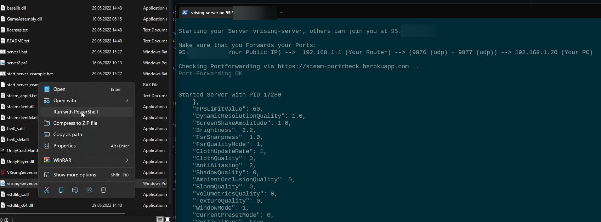

Powershell Script that
- creates a new directory's for every powershell script-instance you use (Save & Settings Folders)
- checks if ports are in use
- checks if port is correctly forwarded (only query port, not the gameport) 
- restart the server and save log files, should it crash
- (optional) notifies you via discord webhook
- shows log in window & logs to file

### install
- just download the script and start it with right-click and "Open with Powershell"
- if you want to run a 2nd server, just copy the script and rename it

